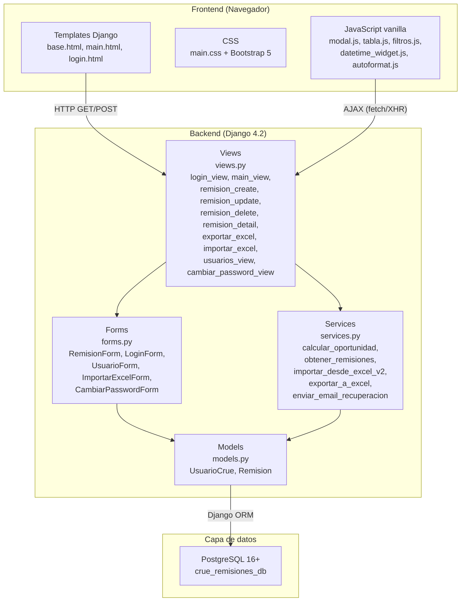
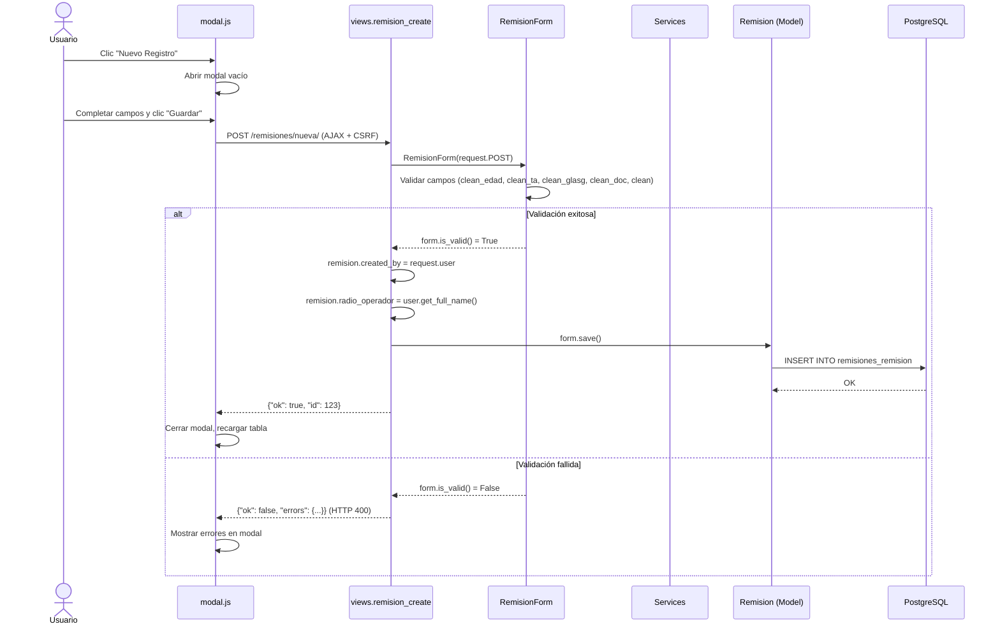
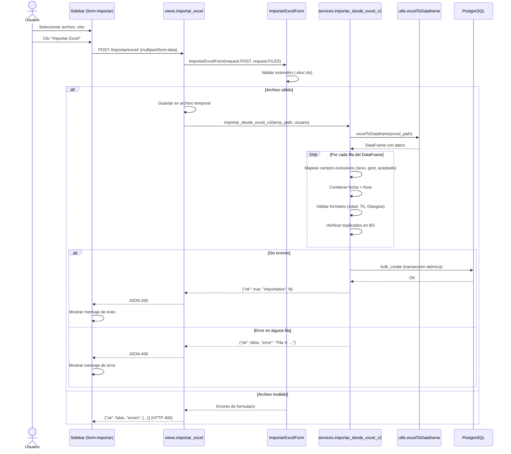
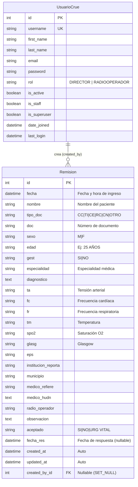
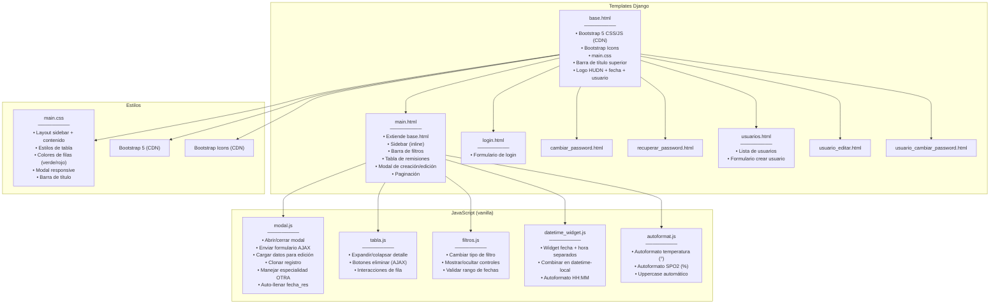

# Arquitectura — CRUE Remisiones Pacientes

## 1. Diagrama de capas

## 2. Diagrama de flujo: Crear una remisión

## 3. Diagrama de flujo: Importar desde Excel

## 4. Diagrama Entidad-Relación

## 5. Diagrama de componentes Frontend

