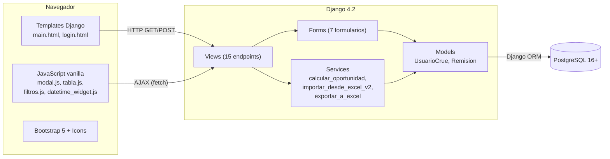
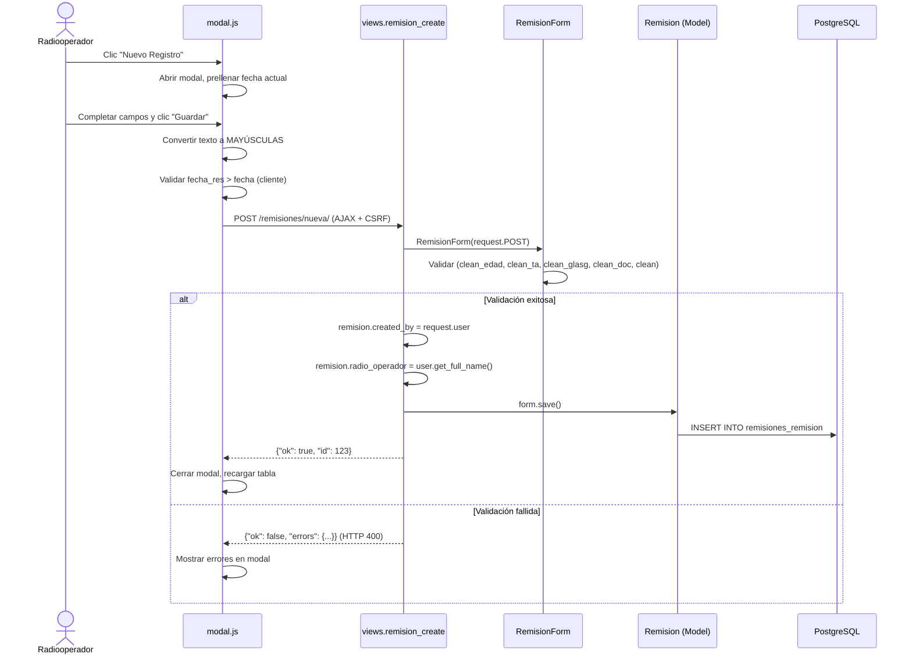
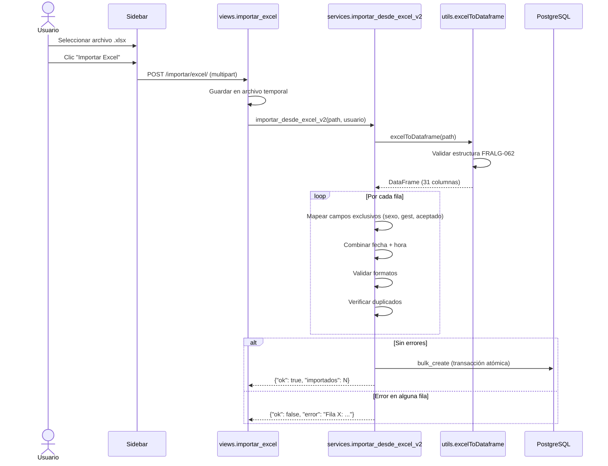
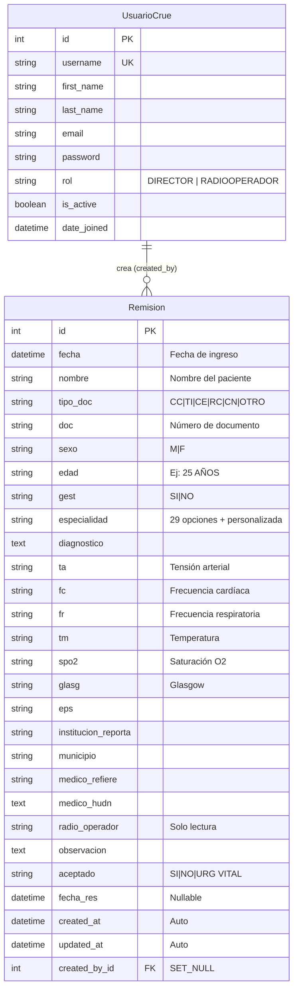

# Informe Final — CRUE Remisiones Pacientes
**Sistema de gestión de remisiones de pacientes comentados por CRUE, ESE, SAS y EPS**

---

- **Autor**: Luis Ernesto Garreta Unigarro
- **Fecha**: 30 de Abril del 2026

## Tabla de Contenidos

1. [Resumen Ejecutivo](#1-resumen-ejecutivo)
2. [Características Principales](#2-características-principales)
3. [Stack Tecnológico](#3-stack-tecnológico)
4. [Arquitectura del Sistema](#4-arquitectura-del-sistema)
5. [Modelo de Datos](#5-modelo-de-datos)
6. [Endpoints del Sistema](#6-endpoints-del-sistema)
7. [Guía de Usuario — Resumen Operativo](#7-guía-de-usuario--resumen-operativo)
8. [Despliegue y Configuración](#8-despliegue-y-configuración)
9. [Estado Actual y Changelog](#9-estado-actual-y-changelog)

---

## 1. Resumen Ejecutivo

### ¿Qué es CRUE Remisiones?

CRUE Remisiones es un sistema web de gestión de remisiones de pacientes diseñado para el Hospital Universitario Departamental de Nariño (HUDN). Funciona como un registro centralizado donde los radiooperadores del CRUE documentan cada remisión de paciente comentada por CRUE, ESE, SAS y EPS, incluyendo datos de identificación, signos vitales, información institucional, especialidad médica requerida y resultado de aceptación.

### Problema que resuelve

El proceso de registro de remisiones de pacientes se realizaba manualmente en hojas de cálculo Excel (formato FRALG-062), lo que generaba problemas de consistencia, duplicación de datos, dificultad para consultar registros históricos y falta de trazabilidad sobre quién registró cada remisión. CRUE Remisiones digitaliza este proceso proporcionando un sistema web con validaciones automáticas, control de acceso por roles, importación/exportación Excel y registros con trazabilidad completa.

### ¿Para quién es?

| Rol | Descripción | Interacción |
|---|---|---|
| **Radiooperador** | Personal operativo del CRUE | Registra, consulta, edita y clona remisiones. Exporta e importa desde Excel. Cambia su contraseña. |
| **Director** | Administrador del sistema | Todas las funciones del Radiooperador + gestión de usuarios (crear, editar, cambiar contraseña, eliminar). |
| **Administrador técnico** | Responsable de infraestructura | Configura base de datos, variables de entorno, despliegue y backups. |

### Principios de diseño

- **Propiedad de registros**: Cada remisión pertenece al usuario que la creó. Solo el propietario puede editar o eliminar sus registros del día actual.
- **Registros históricos protegidos**: Los registros de días anteriores son de solo lectura — no se pueden modificar ni eliminar.
- **Entrada en mayúsculas**: Todos los campos de texto se convierten automáticamente a mayúsculas para consistencia con el formato FRALG-062.
- **Validación doble**: Validación en el cliente (JavaScript) y en el servidor (Django forms) para todos los campos críticos.

---

## 2. Características Principales

### 2.1 Tabla de Remisiones (Vista Principal)

Tabla estilo Excel que muestra los registros filtrados del período seleccionado.

- Tres modos de filtrado: **por mes** (defecto), **por rango de fechas** y **por documento**.
- Paginación opcional (20 registros por página).
- Colores por estado de aceptación: **verde** (SI), **rojo** (URG VITAL), sin color (NO).
- Fila de detalle expandible con campos adicionales (diagnóstico, EPS, médicos, observación, oportunidad).
- Botones de acción con iconos Bootstrap: eliminar (🗑️), editar (✏️), clonar (📋), detalle (👁️).

### 2.2 Modal de Creación/Edición

Diálogo modal con formulario completo para crear y editar remisiones.

- Widget de fecha nativo (`<input type="date">`) + campo de hora separado (`HH:MM`) en formato militar 24h.
- Campo de **especialidad** con 29 opciones predefinidas + opción "Otra" para valores personalizados.
- Campo **radio_operador** de solo lectura, asignado automáticamente al nombre del usuario creador.
- Validación en tiempo real: fecha de respuesta debe ser posterior a fecha de ingreso.
- Auto-llenado de fecha de respuesta al escribir en el campo Observación.
- Modo solo lectura para registros históricos o de otros usuarios.

### 2.3 Clonación de Registros

Copia todos los campos de un registro existente excepto:
- `fecha` (se asigna la fecha/hora actual)
- `radio_operador` (se asigna al usuario actual)
- `aceptado` (se resetea a NO)
- `fecha_res` y `oportunidad` (se dejan vacíos)

### 2.4 Importación desde Excel

- Formato **FRALG-062** con validación completa de estructura, encabezados y datos.
- Validación de campos exclusivos (sexo, gestante, aceptado).
- Detección de duplicados (documento + fecha).
- Importación **atómica**: si falla una fila, no se importa ninguna.

### 2.5 Exportación a Excel

- Genera archivo `.xlsx` con todos los campos de la remisión.
- Incluye columna calculada **OPORTUNIDAD** (diferencia entre fecha de respuesta y fecha de ingreso en formato HH:MM).
- Respeta el filtro activo (mes, rango o documento).

### 2.6 Gestión de Usuarios (solo Director)

- Crear usuarios con nombre, apellido, correo, contraseña y rol.
- Editar información de usuarios existentes.
- Cambiar contraseña de cualquier usuario (sin requerir la contraseña actual).
- Eliminar usuarios (excepto el propio).
- Recuperación de contraseña por correo electrónico.

### 2.7 Validaciones Implementadas

| Validación | Descripción |
|---|---|
| Fecha de respuesta > Fecha de ingreso | Validación cliente (JS) y servidor (Django) |
| Formato de edad | `N AÑOS`, `N MESES`, `N DIAS` |
| Formato de tensión arterial | `120/80` o `NO REFIERE` |
| Formato de Glasgow | `15/15` o `NO REFIERE` |
| Documento solo numérico | Solo dígitos permitidos |
| Duplicados en importación | DOC + FECHA únicos |
| Campos exclusivos en importación | Sexo, gestante, aceptado |
| Entrada en mayúsculas | Conversión automática en todos los campos de texto |

---

## 3. Stack Tecnológico

| Componente | Tecnología | Propósito |
|---|---|---|
| Backend | Django 4.2 (SSR con templates) | Framework web, ORM, autenticación |
| Base de datos | PostgreSQL 16+ | Almacenamiento persistente con integridad referencial |
| Frontend | Bootstrap 5 + JavaScript vanilla | Interfaz responsive, modal AJAX, tabla interactiva |
| Iconos | Bootstrap Icons (CDN) | Iconos de acciones y navegación |
| Exportación/Importación | openpyxl + pandas | Lectura/escritura de archivos Excel |
| Servidor producción | gunicorn + nginx | Servidor WSGI + proxy inverso |
| Contenedores | Docker + Docker Compose | Despliegue reproducible |

### Decisiones técnicas clave

- **SSR sobre SPA**: Django renderiza HTML completo. Las operaciones CRUD del modal se resuelven con `fetch()` AJAX que envían formularios y reciben JSON. No hay API REST separada ni framework frontend.
- **JavaScript vanilla sobre frameworks**: Las interacciones dinámicas (modal, tabla, filtros, widget de fecha) se implementan con JavaScript puro, sin dependencias de React/Vue/Angular. Esto simplifica el despliegue y elimina el build step.
- **Bootstrap por CDN**: Para el MVP no se requiere build step ni `collectstatic` de CSS. En producción se recomienda servir archivos estáticos localmente.
- **PostgreSQL sobre SQLite**: Integridad referencial, soporte de concurrencia, índices optimizados y compatibilidad con despliegue en producción.

---

## 4. Arquitectura del Sistema

### 4.1 Visión General

CRUE Remisiones sigue una arquitectura **Server-Side Rendering (SSR)** con Django Templates y comunicación AJAX para las operaciones CRUD.



### 4.2 Estructura del Proyecto

```
app_crue_remisiones/
├── config/                          # Configuración Django
│   ├── settings.py                  # PostgreSQL, timezone America/Bogota
│   ├── settings_test.py             # SQLite en memoria para tests
│   ├── urls.py                      # URLs raíz
│   └── wsgi.py                      # Punto de entrada WSGI
├── remisiones/                      # Aplicación principal
│   ├── models.py                    # UsuarioCrue + Remision (25+ campos)
│   ├── views.py                     # 15 vistas/endpoints
│   ├── forms.py                     # 7 formularios Django
│   ├── services.py                  # Lógica de negocio desacoplada
│   ├── utils.py                     # excelToDataframe (formato FRALG-062)
│   ├── admin.py                     # Admin Django
│   ├── urls.py                      # 15 rutas URL
│   ├── migrations/                  # Migraciones de BD
│   ├── static/remisiones/
│   │   ├── css/main.css             # Estilos (sidebar, tabla, modal)
│   │   ├── img/logos/               # logo_hudn.png, logo_hudn-64x64.png
│   │   └── js/
│   │       ├── modal.js             # Modal CRUD + clonación + especialidad
│   │       ├── datetime_widget.js   # Widget fecha + hora separados
│   │       ├── tabla.js             # Interacciones de tabla
│   │       ├── filtros.js           # Lógica de filtros
│   │       └── autoformat.js        # Autoformato signos vitales
│   ├── templates/remisiones/        # 9 plantillas HTML
│   └── templatetags/               # Filtro truncar_para_tabla
├── docs/                            # Documentación (7 archivos)
├── manage.py
├── requirements.txt
└── pytest.ini
```

### 4.3 Flujo Principal: Crear una Remisión



### 4.4 Flujo: Importar desde Excel



---

## 5. Modelo de Datos

### 5.1 Diagrama Entidad-Relación



### 5.2 UsuarioCrue

Extiende `AbstractUser` de Django. Hereda todos los campos estándar y agrega:

| Campo | Tipo | Restricciones | Descripción |
|---|---|---|---|
| `rol` | CharField(15) | choices: DIRECTOR, RADIOOPERADOR. Default: RADIOOPERADOR | Rol del usuario en el sistema |

### 5.3 Remision

| Grupo | Campos | Notas |
|---|---|---|
| Tiempo de ingreso | `fecha` | DateTimeField, obligatorio |
| Identificación | `nombre`, `tipo_doc`, `doc`, `sexo`, `edad`, `gest` | `doc` solo dígitos, `edad` formato validado |
| Especialidad | `especialidad` | CharField(100), 29 opciones + personalizada, opcional |
| Información clínica | `diagnostico`, `ta`, `fc`, `fr`, `tm`, `spo2`, `glasg` | Todos opcionales, formatos validados |
| Información institucional | `eps`, `institucion_reporta`, `municipio`, `medico_refiere`, `medico_hudn`, `radio_operador`, `observacion` | `radio_operador` asignado automáticamente |
| Resultado | `aceptado`, `fecha_res` | `aceptado` con colores en tabla. `fecha_res` nullable |
| Auditoría | `created_at`, `updated_at`, `created_by` | `created_by` FK → UsuarioCrue (SET_NULL) |

### 5.4 Campos calculados

- **`es_editable`** (propiedad): `True` si `fecha.date() == hoy` en zona horaria `America/Bogota`.
- **`oportunidad`** (dinámico): `fecha_res - fecha` en formato `HH:MM`. Calculado en `services.calcular_oportunidad()`.

### 5.5 Índices

| Campos | Propósito |
|---|---|
| `fecha` | Filtrado por mes y rango de fechas |
| `doc` | Búsqueda por número de documento |

---

## 6. Endpoints del Sistema

### Resumen completo

| Método | URL | Auth | Permisos | Descripción |
|---|---|---|---|---|
| GET/POST | `/login/` | No | Público | Autenticación de usuario |
| POST | `/logout/` | No | Público | Cierre de sesión |
| GET/POST | `/recuperar-password/` | No | Público | Recuperar contraseña por email |
| GET | `/` | Sí | Cualquier usuario | Vista principal con tabla y filtros |
| POST | `/remisiones/nueva/` | Sí | Cualquier usuario | Crear remisión (AJAX → JSON) |
| GET | `/remisiones/<pk>/detalle/` | Sí | Cualquier usuario | Detalle de remisión (AJAX → JSON) |
| POST | `/remisiones/<pk>/editar/` | Sí | Solo propietario | Editar remisión (AJAX → JSON) |
| POST | `/remisiones/<pk>/eliminar/` | Sí | Solo propietario | Eliminar remisión (AJAX → JSON) |
| GET | `/exportar/excel/` | Sí | Cualquier usuario | Exportar a Excel (.xlsx) |
| POST | `/importar/excel/` | Sí | Cualquier usuario | Importar desde Excel (FRALG-062) |
| GET/POST | `/usuarios/` | Sí | Solo DIRECTOR | Listar y crear usuarios |
| GET/POST | `/usuarios/<pk>/editar/` | Sí | Solo DIRECTOR | Editar usuario |
| GET/POST | `/usuarios/<pk>/cambiar-password/` | Sí | Solo DIRECTOR | Cambiar contraseña de usuario |
| POST | `/usuarios/<pk>/eliminar/` | Sí | Solo DIRECTOR | Eliminar usuario |
| GET/POST | `/cambiar-password/` | Sí | Cualquier usuario | Cambiar contraseña propia |

### Notas sobre los endpoints

- Los endpoints CRUD de remisiones (`/remisiones/nueva/`, `/<pk>/editar/`, `/<pk>/eliminar/`) retornan **JSON** (`{"ok": true/false, ...}`), no HTML.
- El endpoint de detalle (`/<pk>/detalle/`) retorna JSON con todos los campos + `es_editable` + `es_propio`.
- Los endpoints de gestión de usuarios retornan **HTML** (redirect o renderizado de template).
- La edición y eliminación de remisiones requieren que el registro sea del **día actual** Y pertenezca al **usuario actual**.

---

## 7. Guía de Usuario — Resumen Operativo

### Flujo de trabajo diario del Radiooperador

1. **Inicio de jornada**: Acceder al sistema, iniciar sesión con usuario y contraseña.
2. **Registrar remisiones**: Clic en "Nuevo Registro" → completar formulario → Guardar. La fecha y el radio operador se asignan automáticamente.
3. **Consultar registros**: Usar filtros por mes (defecto), rango de fechas o documento. Expandir filas con el botón de detalle (👁️).
4. **Editar registros del día**: Clic en editar (✏️) → modificar campos → Guardar. Solo registros propios del día actual.
5. **Clonar registros**: Clic en clonar (📋) para crear una copia rápida con nueva fecha.
6. **Registrar respuesta**: Al escribir en Observación, la fecha de respuesta se auto-llena. Verificar y ajustar si es necesario.
7. **Exportar**: Desde el sidebar, clic en "Excel" para descargar los registros del filtro activo.

### Flujo de trabajo del Director

Todo lo anterior, más:

1. **Gestionar usuarios**: Sidebar → Gestión → Usuarios.
2. **Crear usuario**: Botón "Nuevo Usuario" → completar formulario → Crear.
3. **Editar/Cambiar contraseña**: Botones "Modificar" y "Contraseña" en cada fila de usuario.
4. **Importar datos históricos**: Sidebar → Importar → seleccionar archivo Excel FRALG-062 → Importar.

### Campo Especialidad

- Seleccionar de la lista desplegable (29 especialidades médicas).
- Si no está en la lista, seleccionar "Otra (escribir)" → aparece campo de texto para escribir la especialidad personalizada.
- El valor personalizado se guarda directamente en el campo `especialidad`.

### Registros históricos

- Los registros de días anteriores aparecen con el botón de eliminar deshabilitado (gris).
- Al intentar editar, el modal se abre en modo **solo lectura**.
- Los registros de otros usuarios también se abren en modo solo lectura.

---

## 8. Despliegue y Configuración

### 8.1 Prerrequisitos

- Python 3.12+
- PostgreSQL 16+
- pip

### 8.2 Instalación

```bash
git clone <url-del-repositorio>
cd app_crue_remisiones
python -m venv .venv
source .venv/bin/activate
pip install -r requirements.txt
```

### 8.3 Variables de Entorno

| Variable | Descripción | Ejemplo |
|---|---|---|
| `DB_NAME` | Nombre de la base de datos | `crue_remisiones_db` |
| `DB_USER` | Usuario de PostgreSQL | `postgres` |
| `DB_PASSWORD` | Contraseña de PostgreSQL | `contraseña_segura` |
| `DB_HOST` | Host de PostgreSQL | `localhost` |
| `DB_PORT` | Puerto de PostgreSQL | `5432` |

### 8.4 Configuración de PostgreSQL

```sql
CREATE DATABASE crue_remisiones_db ENCODING 'UTF8';
CREATE USER crue_user WITH PASSWORD 'contraseña_segura';
ALTER ROLE crue_user SET client_encoding TO 'utf8';
ALTER ROLE crue_user SET default_transaction_isolation TO 'read committed';
ALTER ROLE crue_user SET timezone TO 'America/Bogota';
GRANT ALL PRIVILEGES ON DATABASE crue_remisiones_db TO crue_user;
```

### 8.5 Migraciones y Arranque

```bash
python manage.py migrate
python manage.py createsuperuser    # Crear usuario administrador
python manage.py runserver           # Desarrollo
gunicorn config.wsgi:application     # Producción
```

### 8.6 Checklist de Producción

| Item | Acción requerida |
|---|---|
| `DEBUG` | Cambiar a `False` |
| `SECRET_KEY` | Generar clave secreta única |
| `ALLOWED_HOSTS` | Restringir a dominios/IPs del servidor |
| HTTPS | Configurar SSL/TLS |
| CSRF | Configurar `CSRF_TRUSTED_ORIGINS` |
| Email | Configurar SMTP para recuperación de contraseña |
| Archivos estáticos | Ejecutar `python manage.py collectstatic` |
| Servidor WSGI | Usar gunicorn (no `runserver`) |
| Proxy inverso | Configurar nginx |
| Backups | Configurar respaldos automáticos de BD |

---

## 9. Estado Actual y Changelog

### Versión actual: v3.0

El sistema se encuentra en estado funcional completo, preparado para despliegue en producción.

### Historial de versiones

| Fecha | Versión | Cambios |
|---|---|---|
| Abr 30, 2026 | **v3.0** | Campo especialidad (29 opciones + personalizada). Observación auto-llena fecha_res. Correcciones de especialidad. Documentación final completa (7 documentos). |
| Abr 29, 2026 | **v2.9** | Entrada en mayúsculas. Fechas en español. Validación fecha_res > fecha (cliente + servidor). |
| Abr 29, 2026 | **v2.8** | Clonación completa de registros. Radio operador solo lectura. Propiedad de registros (solo editar propios). |
| Abr 29, 2026 | **v2.7** | Gestión de usuarios: editar info y cambiar contraseña desde la lista. |
| Abr 28, 2026 | **v2.6** | Migración a PostgreSQL. Renombrado de campos a minúsculas. |
| Abr 28, 2026 | **v2.5** | Renombrar `perfil` → `rol`. Nuevo widget fecha/hora (date picker + HH:MM). Reorden de campos. Logos, iconos Bootstrap y tooltips. Colores del sidebar. |
| Abr 27, 2026 | **v2.0** | Modelo UsuarioCrue (reemplaza User + PerfilUsuario). UX campos de texto grande. Autollenado radio_operador. Widget fecha/hora DD/MM/YYYY HH:MM. Importación Excel con excelToDataframe. |
| Abr 25, 2026 | **v1.0** | Primera versión funcional: CRUD de remisiones, autenticación, filtros, exportación Excel, gestión de usuarios. |

### Funcionalidades implementadas

- ✅ Registro completo de remisiones (CRUD) con 25+ campos
- ✅ Control de acceso por roles (DIRECTOR / RADIOOPERADOR)
- ✅ Propiedad de registros (solo editar/eliminar propios del día actual)
- ✅ Registros históricos protegidos (solo lectura)
- ✅ Importación desde Excel (formato FRALG-062, atómica)
- ✅ Exportación a Excel con oportunidad calculada
- ✅ Filtros por mes, rango de fechas y documento
- ✅ Clonación de registros
- ✅ Campo de especialidad médica (29 opciones + personalizada)
- ✅ Validaciones de datos clínicos (edad, TA, Glasgow, fechas)
- ✅ Entrada automática en mayúsculas
- ✅ Auto-llenado de fecha de respuesta al escribir observación
- ✅ Gestión completa de usuarios (crear, editar, cambiar contraseña, eliminar)
- ✅ Logo institucional HUDN
- ✅ Iconos Bootstrap con tooltips descriptivos
- ✅ Base de datos PostgreSQL
- ✅ Documentación técnica completa (7 documentos)
- ✅ Preparado para despliegue con Docker
